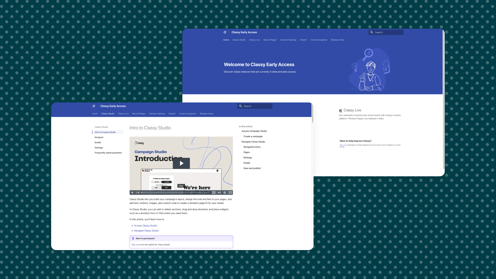

# Enhancing documentation for Early Access features

In a strategic move to streamline our documentation process for features in early access, we evaluated a docs-as-code approach. The goal was to create a centralized documentation home for these features, making information on open/closed beta features readily accessible and consistent.

[View an article in the Early Access Help Center](https://classyacademy.github.io/help-center/domain-masking/)

## Challenge

Our early access documentation was in disarray. Product Marketing Managers (PMMs) traditionally authored documentation for their products, resulting in scattered Google Docs directly shared with customers.

This approach led to significant challenges:

- **Disorganization**: Documentation was dispersed, making it hard to track and access.
- **Limited accessibility:** Both our customer growth and Care teams often lacked access or knowledge of these documents, hindering their ability to support customer questions effectively.
- **Last-minute rush:** The Content Design team frequently received requests for official documentation too close to the product release date, leaving insufficient time for thorough revision and feedback from Subject Matter Experts (SMEs).

Additionally, our reliance on an underperforming and underutilized Content Management System (CMS) was costly, not just in financial terms but also in efficiency. The CMS had a limited feature set without options for customization, offered dynamic content which we had no need for, and suffered from sluggish performance and maintenance challenges.

## Solution

Our solution was to adopt the MkDocs Material Theme, leveraging its simplicity and efficiency for our documentation needs.

This approach allowed us to harness several key benefits:

- **Markdown and Python:** Simplifying content creation and management.
- **Cost-Efficiency and Speed:** Significantly reducing our operational costs and speeding up documentation processes.
- **Version Control:** Using Git for better tracking and revisions.
- **Flexibility:** Easily updating and customizing content as needed.

## Results achieved

By Q4 of 2023, the transformation was evident. The Early Access (EA) help center had become an essential component of our release process for all new features. This centralized hub offered customers and support teams a "one-stop-shop" for documentation, sign-up links, expected release timelines, and release notes.

The Content Design team began drafting documentation months in advance, as opposed to weeks, allowing for comprehensive reviews by PMMs and customers. The early and frequent communication between teams ensured robust feedback before the General Availability (GA) release, markedly improving the quality and effectiveness of our documentation.

This initiative not only enhanced our documentation process but also fostered better collaboration across teams, significantly improved support for our customers, and delivered considerable cost and time savings.
