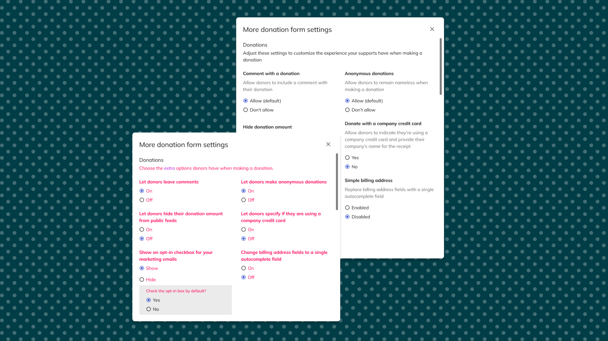
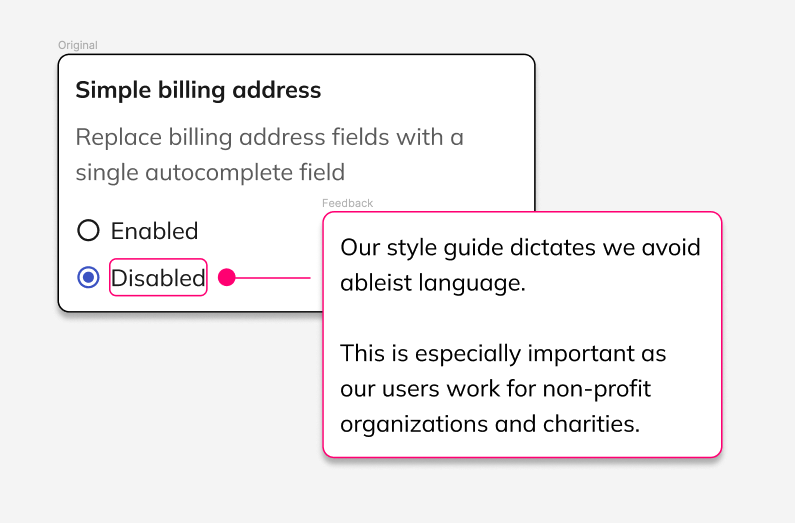
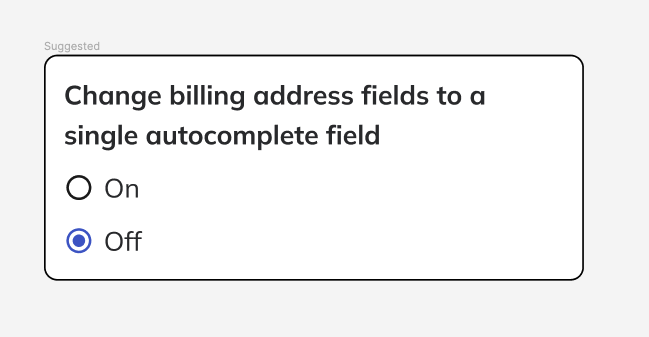
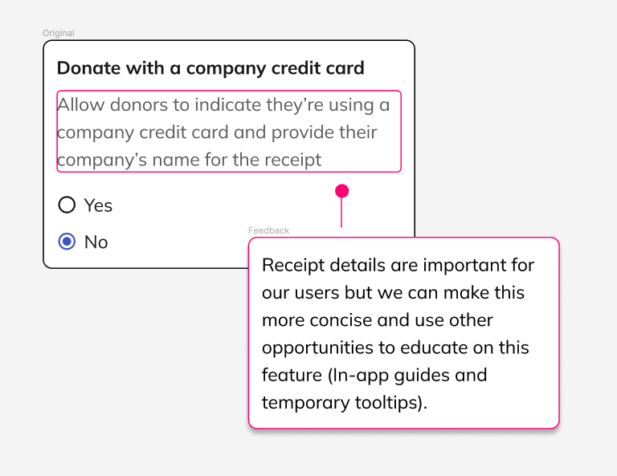
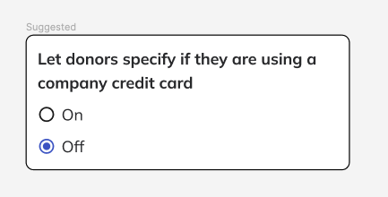
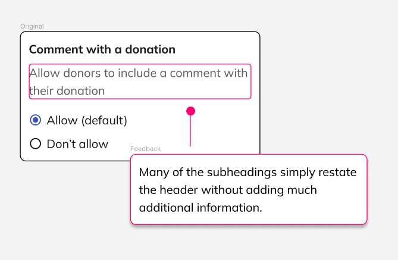
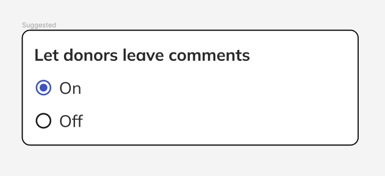
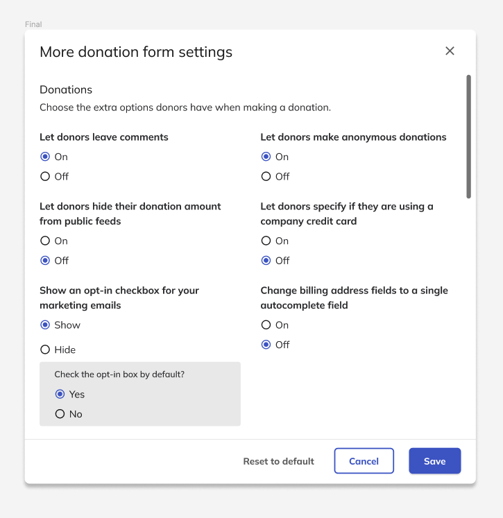
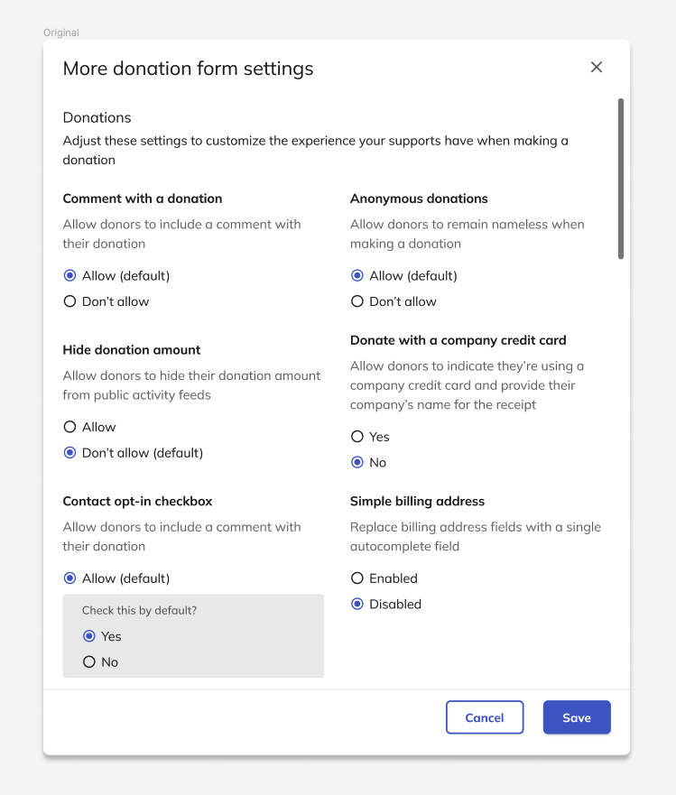

# Refining product copy for Classy Studio campaign builder

<!--  -->

The launch of Classy Studio, our new campaign builder, presented an opportunity to refine our product copy to better align with our brand's voice and style guidelines. This project focused on revising the initial draft of the feature's settings to enhance clarity, accessibility, and overall user experience.

## Initial feedback

The initial draft of the product copy for Classy Studio faced several challenges:

- **Non-adherence to style guide:** Certain terms and phrases didn't align with our established style guide, leading to inconsistencies in language use.

=== "Original with feedback"

    

=== "Suggested"

    

- **Wordiness:** The copy was verbose, potentially overwhelming users with unnecessary information.

=== "Original with feedback"

    

=== "Suggested"

    

- **Redundant subheadings:** Many subheadings duplicated information, adding to the clutter without providing additional value.

=== "Original with feedback"

    

=== "Suggested"

    

These issues highlighted the need for a comprehensive review and revision of the product copy to ensure it met our standards and the needs of our users.

## Suggestion

To address the feedback, we undertook a series of revisions:

- **Streamlining content:** Subheadings that were found to be redundant were removed to simplify the navigation and readability of the content.
- **Language adjustment:** We meticulously adjusted the language to ensure it was not only accessible but also fully compliant with our style guide. This involved replacing terms like "allow" and "disable" with more user-friendly language that better reflected our brand's tone and values.

=== "Final"

    

=== "Original"

    

## Results achieved

The product recently transitioned from beta to General Availability (GA), and while comprehensive results are still forthcoming, the initial feedback has been overwhelmingly positive:

- **Positive beta feedback:** Beta customers provided over 100 pieces of feedback on various aspects of Classy Studio, yet none pertained to the settings section—a testament to the effectiveness of the copy revisions.
- **Anticipated impact:** Although it's early days, the lack of feedback on the settings suggests that our revisions have significantly improved the user experience, aligning the product copy with user expectations and our brand's standards.

The work on Classy Studio's product copy exemplifies our commitment to continuous improvement and user-centric design. As we collect more data post-GA release, we look forward to further validating the positive impact of these revisions on user engagement and satisfaction.
