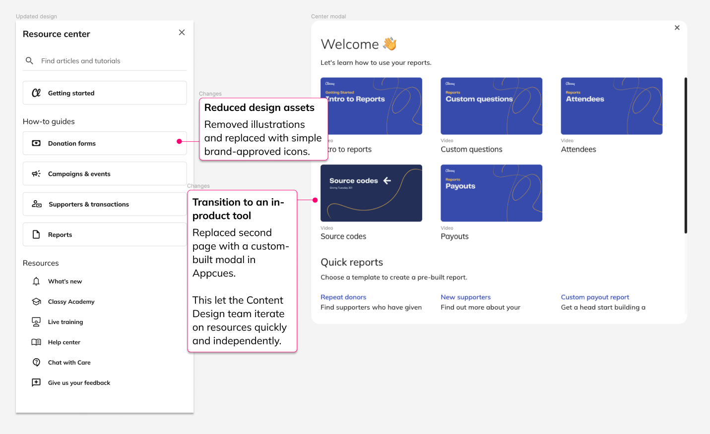

# Streamlining in-app education through a centralized Resource Center

Aiming to enhance the educational experience for admins, we designed a comprehensive resource center intended to serve as the primary launchpad for in-app education. This project was driven by the need to consolidate scattered educational materials into a single, easily accessible location.

## Challenge

Previously, our educational resources were dispersed across various platforms, including the Help Center and Academy. This fragmentation led to significant challenges:

- **Accessibility issues:** Customers struggled to locate necessary resources, often defaulting to Chat support as their first line of inquiry.
- **Overwhelmed Care team:** The dispersion of resources contributed to an increased volume of support cases, resulting in slower response times and negatively impacting our Net Promoter Score (NPS).

The initial design of the resource center aimed to address these issues by incorporating features such as search functionality, video launches, and in-app guides. However, it soon became apparent that the design was not without its flaws, requiring burdensome requests for iteration and inefficient use of space.

## Solution

After evaluating the initial feedback, significant revisions were made:

- **Simplification:** We removed unnecessary illustrations to declutter the interface.
- **Reorganization:** Tiles were reorganized to accommodate more content in a user-friendly manner.
- **Efficiency:** The second layer of navigation was replaced with Appcues guides, allowing for faster iterations and control by the Content Design team without needing constant developer support.

## Results achieved

The impact of these changes was profound:

- **Reduced support cases:** We saw a 45% YoY reduction in Reporting Care cases in Q4 2023, significantly alleviating the burden on our Care team.
- **Increased engagement:** The resource center engaged over 1000 admins per month, indicating a strong user interest in the consolidated educational tools.

## View a prototype

<iframe style="border: 1px solid rgba(0, 0, 0, 0.1);" width="800" height="450" src="https://www.figma.com/embed?embed_host=share&url=https%3A%2F%2Fwww.figma.com%2Fproto%2FauAODHwuLXye7ZVujOpjY2%2FProjects%3Ftype%3Ddesign%26node-id%3D49-11761%26t%3DOFbqOs2ZTlBQJIrl-1%26scaling%3Dscale-down-width%26page-id%3D0%253A1%26starting-point-node-id%3D49%253A11761%26mode%3Ddesign" allowfullscreen></iframe>

## Next steps

While the resource center has made considerable strides in improving in-app education, our goal moving forward is to further boost the adoption of these in-app resources. Currently, less than 10% of admins who engage with our resources file a care case within the next 30 days. Our focus will be on enhancing the visibility and utility of these resources to further reduce dependency on direct support and empower our users with the knowledge and tools they need to succeed.
